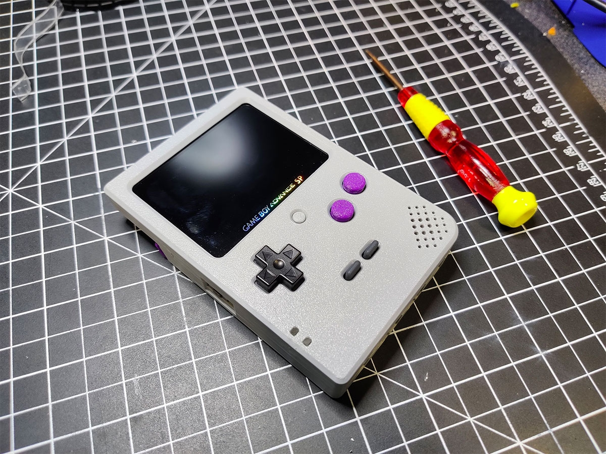

# GBA Slab SP Remix
This is a heavily Remixed version of the “Gameboy SP Slab” V1 originally designed by Xipher.

 

Follow the [Build Guide](https://docs.humblebazooka.com/2022/03/03/how-to-build-our-gba-slab-sp/)

## What's Needed:

* Printed shell files (see ["3D_FILES"](/3D_FILES/))
* 6 x 6 x 5mm Tactile Button (x1) - [Amazon](https://a.co/d/hHaUuPS)
* 8 x 8 x 5mm Soft Tactile Buttons (x2) - [Adafruit](https://www.adafruit.com/product/3101)
* Button PCB board 1mm thickness (see ["PCB_GERBERS"](/PCB_GERBERS/))
* FunnyPlaying "GBASP IPS LAMINATED DISPLAY LCD KITS" - [FunnyPlaying](https://funnyplaying.com/collections/product/products/gbasp-ips-laminated-display-lcd-kits)
* Game Boy Pocket D-Pad, B, and A buttons
* Game Boy Pocket Button Membranes
* Game Boy Advance SP Speaker
* Game Boy Advance SP Motherboard
* Thin 30+ AWG wire

## What Sets This Remix Apart From The Original Slab:
When I initially designed this Remix it had several key differences from the original V1 Slab design. Since then, many of my ideas have been added to Xipher's newer Slab designs. For posterity, I will list items that were different from his V1 design.

* Wall thicknesses and layer heights are now in spec with 0.2mm layer height and Prusa profiles.
* Brightness Button for FunnyPlaying brightness control 
* Resin Front facing light piping for the power status LEDs (I've been told this is now in his latest version)
* Ergonomic angled L & R with soft tactile buttons 
* OEM Battery door nut and screw utilization (the V2 design now has these and based on mine)
* Screen cutout perfectly shows the “Game Boy Advance SP” screen lettering on the FunnyPlaying screen
* Power switch fits like the OEM shell with a satisfying “click”
* Cut out allowing taller and oddly shaped game cartridges like the Game Boy Camera (now in the V2 design)
* Speaker bracket speaker holder for better shell printing
* Bottom shell cutouts for accessories like the GBA wireless adapter (the V2 design now has these and based on mine)
* Cart slot bracket for better FDM printing without overhangs
* Completely redesigned button holes to align correctly to my Button PCB
* Overall remixes to design elements like curves and chamfers to print better
* Some DMG styling like the lower corner
* Battery door is my own design (I designed mine first)

## Acknowledgments
* [Helder](https://www.heldergametech.com) for his knowledge and support
* All the people in the Game Boy community who supported me
